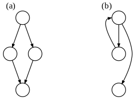

### Understanding Optimizers: Helping the Compiler Help You

#### Nir Friedman


### What this talk is

 - Getting a better feel for what assembly is produced by the compiler
 - Optimizations you can count on the compiler to do for you
 - How the compiler is constrained by producing correct assembly
 - How the compiler is limited by lacking runtime information
 - How the compiler is limited by not knowing what you care about


### What this talk isn't
 - Hardcore tutorial on assembly (or relative instruction latency)
 - Benchmarking of any kind
 - Anything about multi-threading, at all
 - Link time optimization (LTO)

Note:
- Ok, so you probably want to leave now, no sexy stuff!
- No sexy multi-threading, no sexy Chandler Carruth talk about re-ordering
  and branch prediction, no memory layout a la Mike Acton, no
  l3 cache miss is as logN a la Sean Parent, no thin LTO a la Teresa Johnson
- This talk isn't sexy. It's more like mowing the lawn. But you really should
  mow your lawn.


### Background

 - Why is understanding generated assembly well so important?
   - Just write, and measure?
 - Measurement is hard if you're not the end user of your codebase
 - Can cost many man hours, depending on the scope of the change


### My job

 - I work in High Frequency Trading (HFT), but on trading team, not
   infrastructural side
 - Team has only 4 proficient C++ devs, who often have other responsibilities
 - Quick code that has to be written quickly: changing business requirements
 - Extremely complicated config: not a simple matter of the same codepath


### Why am I giving this talk?

 - Not a compiler developer or expert (but I am a user!)
 - Not an expert on the standard
 - But: spent many hours writing code, looking at assembly on Godbolt
 - Mental model for when something will be optimized seems
   not-entirely-defective


### A bit of motivation


### A quick real life example
 - `vector<int>::clear`; O(N)?
 - Came up in code review
   - Choice between `clear` or maintaing our own "size"
 - How quickly do you know the answer?
 - How much does it depend on implementation details?
 - Come back to this example later

Note:
- poll audience
- clear doesn't change capacity, so no malloc/free
- therefore, it's a question of whether it's an almost no-op call


### A saga of sorting
<table>
	<thead><tr>
        <th>Experience</th>
        <th>Beliefs</th>
    </tr></thead>
    <tbody>
    <tr>
        <td>Beginner</td>
        <td>qsort and std::sort are both NlogN</td>
    </tr>
    <tr>
        <td>Learning</td>
        <td>Read Scott Meyers, Effective STL, std::sort faster</td>
    </tr>
    <tr>
        <td>Expert Beginner</td>
        <td>Compiler is "smart". Compiler will inline function pointer</td>
    </tr>
    <tr>
        <td>Experienced</td>
        <td>It depends</td>
    </tr>
    </tbody>
</table>

Note:
  - I've had experienced devs be certain qsort would be as fast on modern compilers
  - It's not just about inlining, unwrap the size of the type


### Audience poll:

```
bool my_comp(double x, double y) { return x > y; }

std::sort(v.begin(), v.end(), my_comp); // 1

// OR

std::sort(v.begin(), v.end(), // 2
  [] (double x, double y) {
    return my_comp(x, y);
  });
```


### How to resolve this?
 - Could benchmark
 - More precise in this case: check assembly; ex machina

```
#include <algorithm>
#include <vector>

bool my_comp(double x, double y) { return x > y; }

void foo(std::vector<double>& x) {
  std::sort(x.begin(), x.end(), my_comp);
}
```


### Ex Machina (1)

```
foo(std::vector<double, std::allocator<double> >&):
  push r12
  push rbp
  ...
  call void std::__introsort_loop<....>(...)
```
 - How to check if comparator was inlined?

Note:
  - gcc, O2
  - lots of lines setting up the function
  - introsort is the main (recursive) call of std::sort
  - introsort is heap/quick hybrid sort


### Ex Machina (2)

In the bowels of `__introsort_loop`:
```
.L10:
  movsd xmm1, QWORD PTR [rbp+0]
  movsd xmm0, QWORD PTR [rbx]
  call r12
  test al, al
```

Note:
- push push mov = lots of lines setting up the function
- introsort is the main (recursive) call of std::sort
- introsort is heap/quick hybrid sort
- You don't need to be good at assembly to figure this out


### Sort Saga concluded
 - If I flip O3 on gcc, it gets inlined
 - It doesn't happen for recent MSVC and clang
 - Why not? Isn't this an "easy" optimization?

Note:
- TODO: clean up this section


### Tools to help think about the optimizing compiler

Note:
- start of new section


### Training Day


 - Optimized code must be <u>always</u> <u>correct</u>
 - Always: equivalent to a proof that for all inputs, the
   optimized code behaves the same as un-optimized
 - Correct: defined by the "as-if" rule; observable behavior
   cannot change

Note:
- Observable behavior itself requires precise definition,
  of course


### Basic blocks 101

> In compiler construction, a basic block is a straight-line code sequence with
> no branches in except to the entry and no branches out except at the exit

 - Inside a basic block: anything goes, mostly unobservable
 - Exceptions: globals, multi-threading, volatile
 - Basic blocks must be correct on *entry* and *exit*
 - Function always begin a new basic block, and often unknowable entry points

Note:
- Definition from wikipedia
- relate basic blocks back to observable behavior
- Writes to globals are a side effect, cannot be eliminated
  (though you can combine writes, delay, etc)
- volatile reads/writes (won't discuss)
- multi-threading: cannot violate sequenced-before/after rules
  (but, as promised, won't discuss)


### Basic blocks Examples (1)



Note:
- ask audience: what structures are these?
- First is if: with an else clause, or without? (with)
- Second is loop: which kind? for, do while, or while? (while)


### Basic blocks Examples (2)

```
void bar();

void foo(const vector<int>& x, bool b) {
   for (auto e : x) {
     // Code region A
     if (b) bar();
     // Code region B
   }
}
```

Note:
 - count basic blocks (assume region A, B, bar, are all one)
 - don't worry about exact number (some arbitrary choices)
 - 1 (for loop initialization)
 - 1 (for loop test)
 - for loop body: A (1), if body (1), bar (1)
 - Emphasize the loop blocks, and that if test is part of A block


### Static vs Dynamic information (1)
 - static -> types
 - dynamic -> values
 - usually

Note:
- TODO: nice arrow icon?


### Static vs Dynamic information

```
void foo(const std::vector<double>& x);

template <std::size_t N>
void bar(const std::array<double, N>& x);
```

Note:
- seems simple, but critical point: compiler doesn't know loop size at
  compile time, not even huge vs tiny
- tends to assume loops are big because being wrong on small loops not
  too expensive


### Summary of ways to think about Compiler
 - Constrained to produce correct code
 - Must always consider basic blocks: code in each basic
   block must be correct for every entry and exit
 - Compiler has a lot of some kinds of information (static), and very
   little of others (dynamic, *your* prioritization)
 - Compilers *try* to make changes that are definitely better
 - If unsure, tend to fall back to similarity with written code

Note:
- free yourself from nonsense generalizations: the compiler is (pick one)
  smart/dumb/all-knowing/all-powerful/etc
- This comes from people that either a) have no clue, or b) are
  over-using generalizations for complete beginners


### Optimization Examples


### Inlining

- This is the alpha and omega of optimizations
- Most commonly associated with saving calling overhead
- The real superpower: increases basic block size
- Happens if:
   - the compiler *can* do it (direct vs indirect call)
   - the compiler *wants* to (code bloat tradeoff)

Note:
- special case: empty functions! No bloat obviously,
  so always get "inlined", which is equivalent to deleted


### Inlining (1)
```
double foo(double x,  double y) {
    return x + y;
}

double bar(double x) {
    return foo(x, x);
}
```

```
foo(double, double): # @foo(double, double)
  addsd xmm0, xmm1
  ret
bar(double):
  addsd xmm0, xmm0
  ret
```

Note:
- naive code would have bar as containing two basic blocks, but
  inlining means there's only one


### Inlining (2)

```
void vector<T>::clear() {
  for (auto it = m_begin; it != m_end; ++it) {
    it->~T();
  }
  m_end = m_begin;
}
```

Note:
- let's go back to our example
- call to ~T(). Can compiler inline? Yes, if ~T() is not virtual.
- Will compiler inline? Yes, if ~T is short; definitely if it's
  empty, as it is for any trivially destructible
- inlining empty function, means loop body is empty, loop removed
- Note: no special optimization effort. Different situations from
  memcpy optimizations for trivially copyable


### Const propagation
 - Exception to values being dynamic
 - If: a value is known at compile time
 - Then: use it to influence
   static code generation
 - One of the most important optimizations as a result!

Note:
- Matt Godbolt showed many heavily const prop optimizations
    last year
- Inlining: this shit's chess, not checkers: a "bad" inlining
  can lead to good things, because of const propagation


### Const propagation (arithmetic)

```
int factorial(int x) {
    if (x == 0) return 1;
    return x * factorial(x-1);
}

int foo(int y) {
    return y + factorial(4);
}
```

```
foo(int):
  lea eax, [rdi+24]
  ret
```


### Const propagation (cooler)
```
size_t counter = 0;

void my_for_each(const vector<int>& v,
                 void(*f)(int)) {
    for (auto e : v) f(e);
}

void foo(int x) { if (x == 0) ++counter; }

void bar(const vector<int>& v) {
    my_for_each(v, foo);
}
```


### Const propagation (cooler)
```
bar(vector<int, allocator<int> > const&):
  mov rdx, QWORD PTR [rdi+8]
  mov rax, QWORD PTR [rdi]
  cmp rdx, rax
  je .L1
  mov rcx, QWORD PTR counter[rip]
  xor esi, esi
.L4:
  mov edi, DWORD PTR [rax]
  test edi, edi
  jne .L3
  add rcx, 1
  mov esi, 1
.L3:
  add rax, 4
  cmp rdx, rax
  jne .L4
  test sil, sil
  je .L1
  mov QWORD PTR counter[rip], rcx
.L1:
  ret
```

Note:
- Key point: const propagation can't easily work across function boundaries
- Recall: basic blocks have to be correct for all entry points
- However, `my_for_each` gets inlined into bar, and the constant foo can be prop
  wherever the function parameter in `my_for_each` is used
- This turns an indirect call into a direct one, allowing inlining of foo
- My first example with std::find_if doesn't get inlined by gcc 8.1, on -O2
- Just to emphasize: inlining of function pointer is so unreliable
- As Mark Twain would say, inlining function pointers is like the weather


### Passing by reference

<section><pre><code data-trim data-noescape>
void foo(double x);
void bar();

void qux(const vector<double>& x, const bool<span class="block">&</span> b) {
   for (auto e : x) {
     bar();
     if (b) foo(e);
   }
}
</code></pre></section>

Note:
- TODO: highlight & beside bool in weird color
- Just one character: & makes a world of difference
- What difference does omitting it make?


### Passing by reference (O2)

```
  call bar()
  cmp BYTE PTR [rbp+0], 0
  je .L3
  movsd xmm0, QWORD PTR [rsp+8]
  add rbx, 8
  call foo(double)
```

```
  call bar()
  test bpl, bpl
  je .L3
  movsd xmm0, QWORD PTR [rsp+8]
  add rbx, 8
  call foo(double)
```

Note:
- Audience poll: which is with, vs without, reference?
- similar, except for this one instruction


### Passing by reference (it's not what you know...)

```
bool my_bool = true;
void bar() { my_bool = !my_bool; }
qux(x, my_bool);
```

Note:
- so, assembly *must* recheck bool each iteration
- At O3 this actually prevents pulling the boolean out of the loop!
- As correctness is a proof, showing an optimization would
  be wrong only takes one counter-example


### Impact of const (1)

```
void foo(const int&);

bool bar(int x) {
  const int y = x+1;
  foo(y);
  return y > x;
}
```

Note:
- compiler should be able to call foo, and then simply return true,
  i.e. elide comparison
- Without y being const, it can't
- So const helps us? Right, right, right? (wrong as you transition)


### Impact of const (1)
```
bar(int):
  push rbx
  lea eax, [rdi+1]
  mov ebx, edi
  sub rsp, 16
  lea rdi, [rsp+12]
  mov DWORD PTR [rsp+12], eax
  call foo(int const&)
  cmp DWORD PTR [rsp+12], ebx
  setg al
  add rsp, 16
  pop rbx
  ret
```

Note:
- Fun fact: neither gcc nor clang do this optimization!
- Highlight the cmp instruction
- Seems like they tend to be conservative when a reference escapes
- However, if pass by value to foo, always work
- Another way in which it always works, poll
- Poll: what I just said, contingent on? (foo not being inlined)
- Pass by value or inlining, > const
- cpp slacker: "Const doesn't make zero difference but it rounds to zero"


### Branchs - using and eliminating (1)

```
int foo(optional<int>& x) {
    int y = 1;
    if (x) y = x.value();
    return y;
}
```

Note:
- when I first heard about optional, was surprised that *
  (the "easy" thing to write) does unchecked access
- people said, performance cost, value() introduces another
  branch in idiomatic usage that's unnecessary
- "two branches"


### Branchs - using and eliminating (2)

```
foo(std::optional<int>&):
  cmp BYTE PTR [rdi+4], 0
  mov eax, 1
  je .L1
  mov eax, DWORD PTR [rdi]
.L1:
  ret
```

Note:
 - there's only one branch here.


### Branchs - using and eliminating (3)
```
template <class T>
class optional {
  storage_type m_data;
  bool m_active;

  T& value() {
    if (m_active)
      return reinterpret_cast<T&>(m_data);
    else
      throw ...
  }
}
```


### Branchs - using and eliminating (4)

```
int foo(optional<int>& x) {
    int y = 1;
    if (x) y = x.value();
    return y;
}
```


### Branchs - using and eliminating (5)

```
int foo(optional<int>& x) {
    int y = 1;
    if (x.m_active) {
      if (x.m_active) {
        y = reinterpret_cast<T&>(x.m_data);
      }
      else {
        throw ...
      }
    }
    return y;
}
```

Note:
- hmm, branch inside branch, with same predicate...
- Critical: *only* possible with inlining! Otherwise different basic
  blocks + correctness guarantees make this not happen


### Helping the compiler


### With bool (1)

```
void qux(const vector<double>& x, bool b) {
   for (auto e : x) {
     bar();
     if (b) foo(e);
   }
}
```

Note:
- recall this code from previous slide
- In this case, on O3, the boolean will get pulled out
- However, this isn't robust: if the loop body is longer, compiler will quickly
  decide the code bloat not worth removing the indirection


### With bool (2)
```
void qux(const vector<double>& x, bool b) {
   for (auto e : x) {
     // many lines of code...
     if (b) foo(e);
     // many lines of code...
   }
}
```
Note:
- What if we are certain we want the boolean pulled out of the loop?
- May not care about code size, and icache near non issue if only one branch
  ever executed in a particular process lifecycle


### With bool (3)

```
template <bool B>
void qux(const vector<double>& x) {
  for (auto e : x) {
    // many lines of code...
    if (B) foo(e);
    // many lines of code...
  }
}

void qux(const vector<double>& x, bool b) {
  if (b) qux<true>(x);
  else qux<false>(x);
}
```

Note:
- this is basically guaranteed to turn into the kind of assembly
  we want, even on O2


### With bool (4)

```
template <class F>
void with_bool(bool b, F f) {
  if (b) f(std::true_type{});
  else f(std::false_type{});
}
```

Note:
- encapsulate out the generic idea here, mapping a runtime bool
  into two separate compile time segments


### With bool (5)

```
void qux(const vector<double>& x, bool b) {
  with_bool(b, [&] (auto B) {
    for (auto e : x) {
      // many lines of code...
      if (B) foo(e);
      // many lines of code...
    }
  });
}
```

Note:
- here, use this to more easily write desired version of qux
- why does this work? Because, the template generate two
  copies of the function, in each copy, the bool is constant
  and trivial to remove branch
- Example usage: if buy, sell


### Generic pass by ref/value (1)

```
template <class T>
void foo(const T&);
```


### Generic pass by ref/value (2)

```
template <class T>
constexpr bool pass_by_value_v =
  std::is_trivially_copyable<T>::value && sizeof(T) < 16;

template <class T, enable_if_t<!pass_by_value_v<T>, int> = 0>
void foo(const T&);

template <class T, enable_if_t<pass_by_value_v<T>, int> = 0>
void foo(T t);
```

Note:
 - TODO: make bodies appear later using reveal


### Generic pass by ref/value (3)
```
template <class T, enable_if_t<!pass_by_value_v<T>, int> = 0>
void foo(const T&) { foo_impl(t); /* ? */ }

template <class T, enable_if_t<pass_by_value_v<T>, int> = 0>
void foo(T t) { foo_impl(t); /* ? */ }
```

Note:
- Ok, let's have an implementation function...
- How do we implement the implementation function?


### Generic pass by ref/value (4)

```
template <class T, enable_if_t<!pass_by_value_v<T>, int> = 0>
void foo_impl(const T&) { foo_impl_impl(t); /* ? */ };

template <class T, enable_if_t<pass_by_value_v<T>, int> = 0>
void foo_impl(T t) { foo_impl_impl(t); /* ? */ }
```

Note:
- these slides keep going forever, generated dynamically in js (joke)


### Generic pass by ref/value (5)

```
template <class T>
__attribute__((always_inline)) void foo_impl(const T&);

template <class T, enable_if_t<!pass_by_value_v<T>, int> = 0>
void foo(const T& t) { foo_impl(t); }

template <class T, enable_if_t<pass_by_value_v<T>, int> = 0>
void foo(T t) { foo_impl(t); }
```

Note:
- the compiler works for you! Not the other way around!


### Sort saga, concluded (1)

```
bool my_comp(double x, double y) { return x > y; }

std::sort(v.begin(), v.end(), my_comp);
```

Note:
- This doesn't produce as good assembly, consistently?
- Why not? Comes back to basic blocks that the compiler
  sees "by default"
- Recall: we fixed this issue by writing a lambda that
  calls the function
- the lambda is a unique type, unique instance of sort
  template, lambda gets my_comp inlined
- Can we automate this? Yes, but it only looks nice
  in 17


### Sort saga, concluded (2)

```
template <auto F> // 17 only syntax
struct function_object {
  template <class ... Ts>
  auto operator()(Ts&& ... ts) {
    return f(std::forward<Ts>(ts)...);
  }
};
```


### Sort saga, concluded (3)

```
std::sort(v.begin(), v.end(), function_object<my_comp>{});
```

Note:
- basis for proposal, monostate_function
- Monostate function:
  http://www.open-std.org/jtc1/sc22/wg21/docs/papers/2016/p0477r0.pdf
- fun exercise: write C++14 version (will require a macro at the very end)


### Conclusion

- Don't generalize, about the compiler being smart, or dumb
- Instead, understand the compiler is amazing at some things,
  limited at others
- Understand where you can easily add value to the compiler
- And when you should!

Note:
- chess computers > chess humans
- But, "computer aided" chess is the highest level of all!
